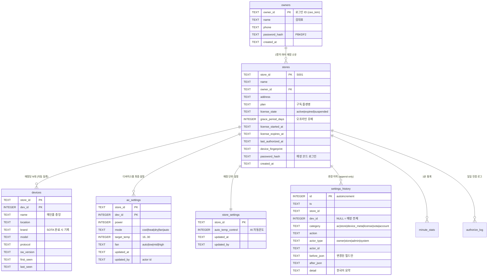

# Atom Air — 클라우드 DB 설계

SQLite(WAL), 단일 파일 `cloud/cloud.db`. 화면(점주 포털 `/store`, 관리자 콘솔 `/admin`)이
요구하는 데이터를 기준으로 설계했으며, 두 가지 원칙을 축으로 한다:

1. **최종 설정값은 항상 DB에 있다** — 제어 명령이 수락되는 순간 `ac_settings`에
   upsert된다. 서버가 재시작해도 대시보드는 마지막 설정값으로 복원된다.
2. **모든 변경은 이력이 남는다** — `settings_history`는 append-only. 누가(actor),
   언제, 무엇을(카테고리/액션), 이전값→이후값(JSON)을 기록한다.

## ERD



`minute_stats`(1분 통계)와 `authorize_log`(라이선스 인증)는 기존 그대로다.

## 테이블별 역할과 화면 매핑

| 테이블 | 화면 요소 | 쓰는 시점 |
|---|---|---|
| `owners` | 점주 로그인, "김대표 (3개 매장)", 매장 드롭다운 | 관리자가 점주 등록 (매장 등록과 동시 가능) |
| `stores` | 매장명/주소/코드, 구독 플랜·상태·만료일(D-n), 제약 배너 | 매장 등록, 구독 관리 |
| `devices` | 장비 카드(이름/위치), 브랜드·모델, S/W 버전 | 첫 패킷 자동 등록, 이름변경, SOTA 완료 |
| `ac_settings` | 카드의 희망온도/전원/모드/바람 — **재접속·재시작 후 복원** | 제어 명령 수락 시 upsert |
| `store_settings` | AI 자동온도 토글 | 토글 변경 시 |
| `settings_history` | (관리·감사 화면) 변경 이력 | 모든 변경에 append |

## 이력 이벤트 카탈로그

| category | action | dev_id | actor | 발생 |
|---|---|---|---|---|
| ac | `ac_control` | 대상 | owner/store/admin | 개별 제어. before/after = 바뀐 필드만 |
| ac | `bulk_control` | NULL | owner/store/admin | 전체 제어 1건 (`applied_devices` 포함) |
| store | `store_settings` | NULL | owner/store/admin | AI 자동온도 on/off |
| device_meta | `device_update` | 대상 | owner/store/admin | 이름/위치 변경 |
| license | `license_update` | NULL | admin | 구독 상태/만료/유예/플랜/점주 변경 |
| sota | `sota_requested` | 대상 | owner/store/admin | 업그레이드 요청 (brand/model/protocol) |
| sota | `sota_done` | 대상 | system(gateway) | 게이트웨이가 완료 보고 |
| account | `store_created` | NULL | admin | 매장 등록 |
| account | `owner_created` | NULL | admin | 점주 계정 생성 |
| account | `password_reset` | NULL | admin | 매장 비밀번호 재설정 (값 미기록) |

## 쓰기 경로 (최종값 + 이력의 이중 기록)

```
웹 제어 명령 ──▶ 검증/패킷 인코딩 ──▶ 게이트웨이(WS) ──▶ Atom Lite IR
                     │
                     ├─▶ hub.ac_states (메모리, 실시간 브로드캐스트)
                     ├─▶ ac_settings   (upsert: 최종값)      ← 재시작 시 여기서 복원
                     └─▶ settings_history (append: 감사)
```

명령이 게이트웨이로 **전송 성공한 뒤에만** 기록한다. 게이트웨이 오프라인이면
에러 반환, 어떤 값도 바뀌지 않는다.

## 조회 API

| 엔드포인트 | 권한 | 내용 |
|---|---|---|
| `GET /api/v1/stores/{id}/history?category=&limit=` | 매장/점주/관리자 | 매장 이력 (최신순, ≤500) |
| `GET /api/v1/admin/history?store_id=&category=` | 관리자 | 전 매장 통합 이력 |
| `GET /api/v1/admin/owners` · `POST` | 관리자 | 점주 목록/등록 |

## 설계 결정 사항

- **`ac_settings`를 `devices`에서 분리** — `devices`는 정체성/메타(누가 어디 설치됐나),
  `ac_settings`는 의도(원하는 상태). 변경 빈도와 쓰기 주체가 다르다.
- **before/after는 바뀐 필드만** — 전체 스냅샷을 넣으면 이력이 diff 불가능한
  덤프가 된다. 요약문(`detail`)은 표시용, JSON은 기계 판독용.
- **bulk는 1행** — 12대 매장에서 전체 제어 한 번이 12행이 되면 이력이 소음이 된다.
  대신 `applied_devices` 수를 기록한다.
- **점주 ID와 매장 코드는 같은 로그인 폼** — 충돌 시 점주가 우선하므로 두 네임스페이스를
  분리해서 발급할 것 (점주는 `ceo_*` 등 접두어 권장).
- **세션에 소유 매장 목록 캐시** — 로그인 시점의 `store_ids`를 세션에 담는다. 관리자가
  매장을 재배정하면 점주는 재로그인해야 반영된다(24h TTL 내 허용 가능한 지연).
